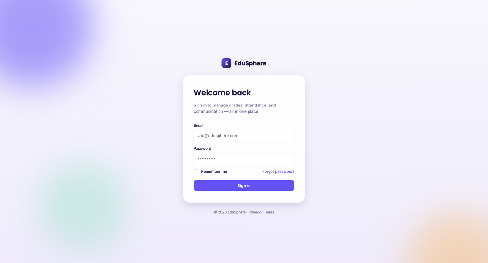
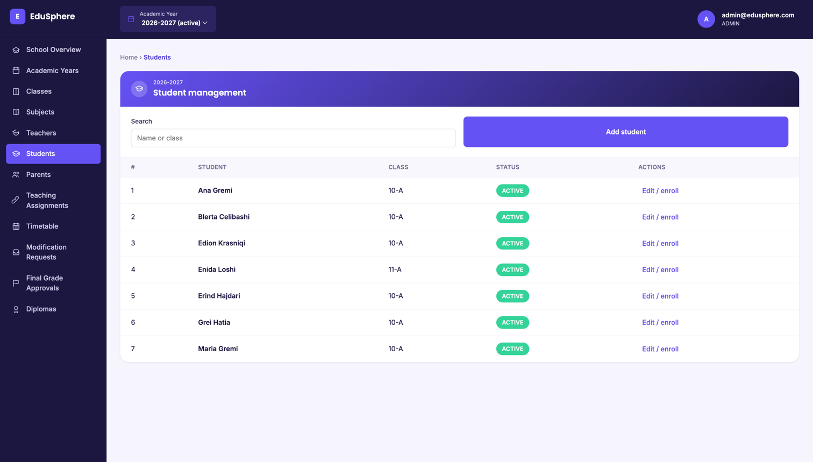
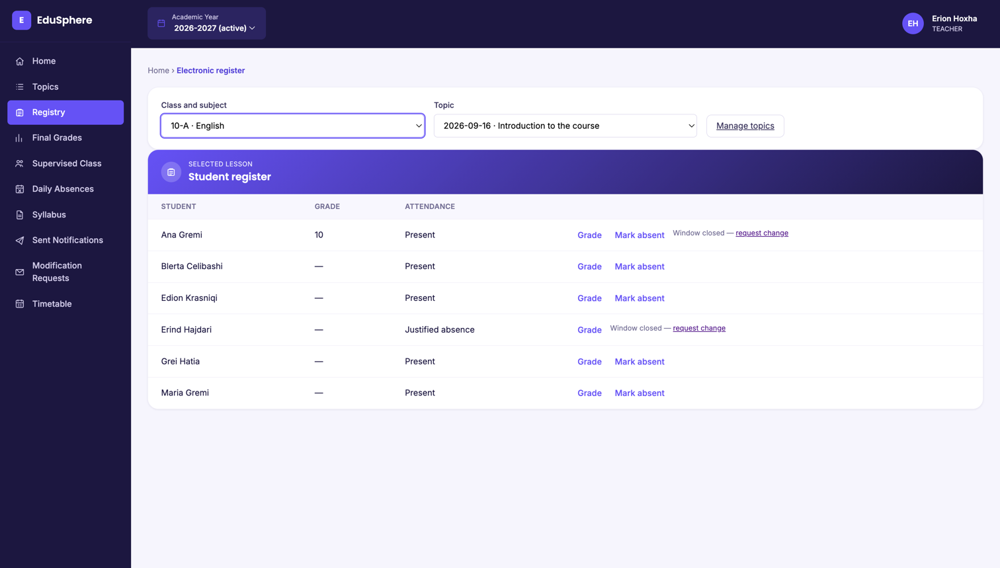
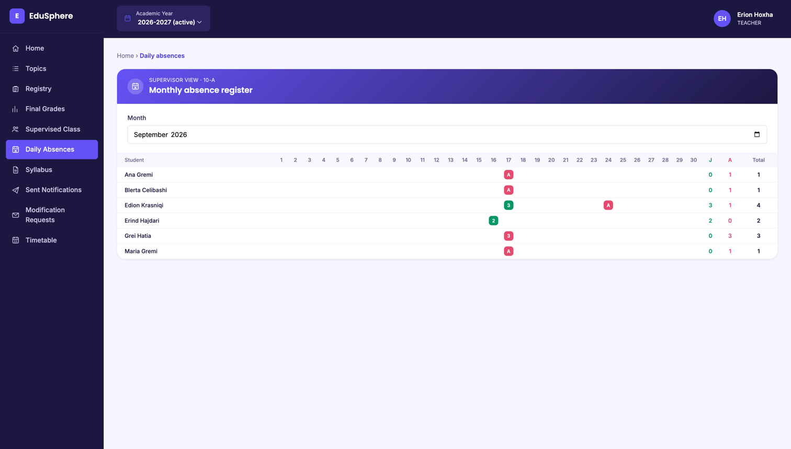
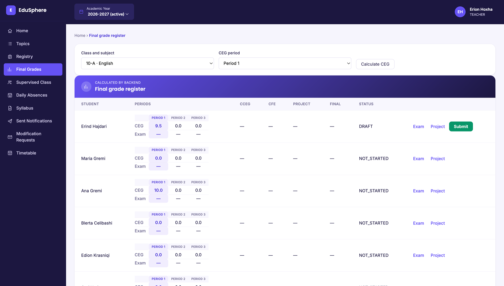
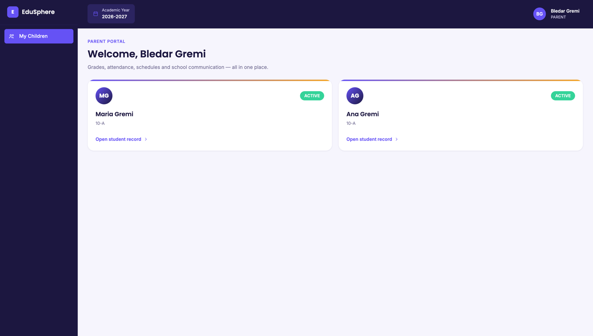

# EduSphere

A school management system built to replace the spreadsheet-and-paper workflow a real school was using for grading, attendance, and parent communication. Role-based access for administrators, teachers, and parents, backed by a JWT-secured REST API.

---

## Screenshots

| Login | Admin — Students | Teacher — Registry |
|---|---|---|
|  |  |  |

| Teacher — Daily Absences | Teacher — Final Grade Register | Parent portal |
|---|---|---|
|  |  |  |

---

## Table of Contents

- [Features](#features)
- [Tech Stack](#tech-stack)
- [Architecture Overview](#architecture-overview)
- [Project Structure](#project-structure)
- [Prerequisites](#prerequisites)
- [Quick Start](#quick-start)
- [Configuration Reference](#configuration-reference)
- [Data Model](#data-model)
- [API Reference](#api-reference)
- [Frontend Routes](#frontend-routes)
- [Authentication Flow](#authentication-flow)
- [Grade Lifecycle](#grade-lifecycle)
- [Academic Year Scoping](#academic-year-scoping)
- [Development Workflows](#development-workflows)
- [Troubleshooting](#troubleshooting)
- [Known Gaps](#known-gaps)

---

## Features

### Administrator
- Academic years (create/activate/deactivate — only one active at a time)
- Classes, subjects, teachers, students, parents — full CRUD
- Link parents to their children
- Teaching assignments (which teacher teaches which subject to which class)
- School-wide timetable editing
- Review and approve/reject teacher-submitted final grades
- Review and approve/reject modification requests (topic/grade/absence/exam-grade changes submitted outside the 24h edit window)
- Generate diploma PDFs per student per academic year

### Teacher
- See only their own teaching assignments, scoped to the academic year selected in the top bar
- Record lesson topics per class/subject, editable for 24h after creation
- Electronic register: per-lesson grades and attendance, deep-linkable from a topic (`/registry?assignmentId=&topicId=`)
- Grade lifecycle: project grade, exam grade per grading period, computed CEG/CCEG/CFE, final grade — draft → submit → admin-approve, or self-service withdraw back to draft
- Supervised class (homeroom teacher view): roster, status changes, whole-class or per-student notifications, parent meeting log, and every subject's final grades for the class
- Monthly attendance grid (SMIP-style) for the supervised class: one row per student, one column per day, justified/unjustified/total columns, click a day to see and justify individual absences
- Syllabus upload (PDF/Word) per teaching assignment
- Teacher forum (post/delete, scoped to your own posts)
- Submit a modification request when the 24h edit window has closed

### Parent
- See linked children only (read-only)
- Per-child: overview, final + per-lesson grades, absence history, weekly timetable, notifications from teachers, diploma downloads

### Cross-cutting
- JWT auth, role-gated routes on both frontend and backend
- Forgot/reset password via emailed token (60-minute expiry)
- Toast-based error/success messaging, no blocking `alert()`s
- Every year-scoped list (assignments, classes, timetables, grade registers, supervised class) actually respects the academic year switcher — not just whichever year happens to be marked active

---

## Tech Stack

### Backend

| Layer | Technology | Version |
|---|---|---|
| Runtime | Java | 17 |
| Framework | Spring Boot | 4.1.1 |
| Web | Spring Web MVC | — |
| Persistence | Spring Data JPA / Hibernate | — |
| Database | MySQL | 8 |
| Auth | Spring Security + JWT (`jjwt`) | 0.12.6 |
| Mail | Spring Boot Mail (Gmail SMTP) | — |
| PDF generation | OpenPDF | 1.3.39 |
| Boilerplate | Lombok | — |
| Build | Maven | — |

### Frontend

| Layer | Technology | Version |
|---|---|---|
| Library | React | 18.3 |
| Language | TypeScript | 5.6 |
| Build tool | Vite | 5.4 |
| Routing | React Router | 6.28 |
| HTTP client | Axios | 1.7 |
| Styling | Plain CSS, custom properties | — |

No UI component library, no state-management library beyond React context — three contexts (`AuthContext`, `AcademicYearContext`, `MessageContext`) cover everything the app needs. No ORM-agnostic abstraction, no microservices — one Spring Boot monolith, one MySQL database, one SPA. That's the right amount of architecture for the scale this is at.

---

## Architecture Overview

```
┌────────────────────────────────────────────────────────────────────┐
│                            BROWSER                                 │
│                                                                     │
│   React SPA (Vite)  ──▶  axios client  ──▶  fetch/XHR calls        │
│   pages/, components/    (api/client.ts)    Authorization: Bearer … │
│   context/ (Auth, Year,                                            │
│   Message)                                                         │
└────────────────────────────┬────────────────────────────────────────┘
                             │  HTTP/JSON   localhost:8080/api
                             ▼
┌────────────────────────────────────────────────────────────────────┐
│                     Spring Boot 4 application                      │
│                                                                     │
│  ┌───────────────┐   ┌──────────────────┐   ┌───────────────────┐ │
│  │ 23 Controllers │──▶│  Service layer   │──▶│  JPA Repositories │ │
│  │ (@RestController,│  │ (business rules, │   │  (Spring Data)    │ │
│  │  @PreAuthorize) │  │  edit-window and  │   └─────────┬─────────┘ │
│  └───────────────┘   │  status guards)   │             │           │
│                       └──────────────────┘             ▼           │
│                                                  ┌─────────────┐   │
│  Filter chain: JwtAuthenticationFilter            │  MySQL      │   │
│  → SecurityContext → @PreAuthorize checks         │  `edusphere`│   │
│                                                    └─────────────┘   │
└────────────────────────────┬────────────────────────────────────────┘
                             │
                    ┌────────▼────────┐
                    │  Gmail SMTP     │
                    │  (password      │
                    │   reset emails) │
                    └─────────────────┘
```

**Request lifecycle example — a teacher grading a lesson:**

1. Teacher opens `/registry`, picks an assignment and topic; the page calls `GET /api/topics/teaching-assignment/{id}` and `GET /api/lesson-records/topic/{topicId}`.
2. Teacher clicks "Grade" on a student, picks a value in `GradeSelectorModal`.
3. Frontend calls `POST /api/lesson-records/grade` with `Authorization: Bearer <jwt>`.
4. `JwtAuthenticationFilter` validates the token and populates the security context; `@PreAuthorize("hasRole('TEACHER')")` on `LessonRecordController` lets the request through.
5. `LessonRecordService` checks the topic belongs to this teacher's assignment, checks the 24h edit window, inserts the row.
6. `201 Created` comes back with the saved record; the frontend refetches the topic's records and re-renders the row.

---

## Project Structure

```
edusphere/
├── README.md
├── backend/                              Spring Boot API (Maven)
│   ├── pom.xml
│   └── src/main/java/com/edusphere/
│       ├── entity/                       20 JPA entities + 5 enums
│       ├── repository/                   Spring Data JPA repositories
│       ├── service/                       Business logic, edit-window/status guards
│       ├── controller/                    23 @RestController classes
│       ├── dto/                           Request/response records
│       └── security/                      JWT filter, JwtService, SecurityConfig,
│                                           CurrentUserProvider
│
├── frontend/                              React SPA (Vite)
│   ├── package.json
│   └── src/
│       ├── api/                           axios wrappers — client.ts, auth.ts,
│       │                                  system.ts (consolidated), plus a few
│       │                                  per-entity files for older admin pages
│       ├── components/                    AppShell, modals, LoginPage, Icon
│       ├── context/                       AuthContext, AcademicYearContext,
│       │                                  MessageContext
│       ├── pages/                         One file per route, grouped by role
│       ├── types/                         Shared TS types
│       ├── styles.css                     Design tokens + all component styles
│       └── App.tsx                        Route table
│
└── docs/
    └── screenshots/                       Referenced by this README
```

---

## Prerequisites

| Tool | Minimum version | Check |
|---|---|---|
| Java (JDK) | 17 | `java -version` |
| Maven | bundled (`./mvnw`) | — |
| Node.js | 18+ | `node -v` |
| MySQL | 8 | `mysql --version` |

---

## Quick Start

### 1. Database

```sql
CREATE DATABASE edusphere;
CREATE USER 'edusphere'@'localhost' IDENTIFIED BY 'your_password';
GRANT ALL PRIVILEGES ON edusphere.* TO 'edusphere'@'localhost';
```

Hibernate handles the schema (`ddl-auto=update`) — no manual migrations to run.

### 2. Backend

Set these environment variables, then start the app:

```bash
cd backend
./mvnw spring-boot:run
```

Runs on `http://localhost:8080`. See [Configuration Reference](#configuration-reference) for what each env var does.

There's no seed data and no default admin account. Create the first one directly:

```bash
curl -X POST http://localhost:8080/api/admin \
  -H "Content-Type: application/json" \
  -d '{"email": "admin@example.com", "password": "changeme"}'
```

Everything else (teachers, students, parents, classes, an academic year) is created through the app once you're logged in as that admin.

### 3. Frontend

```bash
cd frontend
npm install
npm run dev
```

Runs on **`http://localhost:5174`** (fixed in `vite.config.ts`, not the Vite default of 5173) and expects the API at `http://localhost:8080/api` by default — override with a `VITE_API_URL` env var if your backend lives elsewhere.

---

## Configuration Reference

All backend config lives in `backend/src/main/resources/application.properties`, reading from environment variables:

| Variable | Purpose | Default |
|---|---|---|
| `DB_PASSWORD` | MySQL password for the `edusphere` user | — (required) |
| `JWT_SECRET` | HMAC signing key for auth tokens | — (required) |
| `MAIL_USERNAME` | Gmail address that sends password-reset emails | — (required) |
| `MAIL_PASSWORD` | Gmail **App Password** — a regular account password will be rejected by Gmail's SMTP with a 535 auth error | — (required) |
| `FRONTEND_URL` | Base URL used to build the reset-password link in emails | `http://localhost:5174` |

`jwt.expiration-ms` (1 hour) is hardcoded in `application.properties` rather than env-configured, since it rarely needs to change per environment.

Frontend config is just `VITE_API_URL` (optional), read in `api/client.ts`; unset, it falls back to `http://localhost:8080/api`.

**CORS:** `SecurityConfig.corsConfigurationSource()` only allows the origin `http://localhost:5174`. If you run the frontend on a different port, update that allowlist too — a token issue or a wrong API URL isn't the only way cross-origin calls can fail silently.

---

## Data Model

20 entities. The core relationships:

```
AcademicYear (1) ──── (*) SchoolClass ──── (*) TeachingAssignment ──── (1) Subject
                              │                       │
                              │                       ├──── (1) Teacher
                              │                       │
                              (*)                    (*)
                              │                       │
                          Student                   Topic ──── (*) LessonRecord ──── (1) Student
                              │                       │
                   (*) ── Parent (via join table)     └──── (*) SemesterExamGrade ──── (1) GradingPeriod
                              │
                          Diploma, Notification, ParentMeeting

TeachingAssignment + Student (*)──(1) FinalSubjectGrade
  status: DRAFT → SUBMITTED → APPROVED (or back to DRAFT via reject/withdraw)

User (1)──(1) Teacher | Parent | (admin has no linked profile)
  Role: ADMIN | TEACHER | PARENT

ModificationRequest → references exactly one of: Topic | LessonRecord | SemesterExamGrade
PasswordResetToken (1)──(1) User, single-use, 60-minute expiry
```

A `SchoolClass` belongs to exactly one `AcademicYear` — this is why "10-A in 2025-2026" and "10-A in 2026-2027" are different rows, and why almost everything year-scoped ultimately traces back to filtering on `schoolClass.academicYear.id`.

---

## API Reference

**Base URL:** `http://localhost:8080/api`. Every endpoint except `/api/auth/**`, `/api/admin` (bootstrap), and `/files/**` requires `Authorization: Bearer <jwt>`.

| Resource | Method & path | Role | Notes |
|---|---|---|---|
| **Auth** | `POST /auth/login` | public | Returns `{ token }` |
| | `POST /auth/forgot-password` | public | Emails a reset link |
| | `POST /auth/reset-password` | public | Consumes the emailed token |
| **Admin bootstrap** | `POST /admin` | public | Creates the first ADMIN user |
| **Profile** | `GET /me` | any | Current user's identity, role, linked profile id |
| **Academic Years** | `GET /academic-year`, `/all`, `/{label}` | any | |
| | `GET /academic-year/{id}/grading-periods` | any | |
| | `POST /academic-year/create` | ADMIN | |
| | `PUT /academic-year/{id}/activate` \| `/deactivate` | ADMIN | Only one year active at a time |
| **Classes** | `GET /classes`, `/{classId}` | any | `?academicYearId=` filter |
| | `GET /classes/supervised/me` | TEACHER | `?academicYearId=` filter |
| | `POST /classes/create` | ADMIN | |
| | `PUT /classes/{classId}/assign-supervisor` | ADMIN | |
| **Subjects** | `GET /subjects`, `/program-year/{year}` | any | |
| | `POST /subjects`, `PUT /subjects/{id}`, `DELETE /subjects/{id}` | ADMIN | |
| **Teachers** | `GET /teachers`, `/{id}` | any | |
| | `POST /teachers`, `PUT /teachers/{id}` | ADMIN | |
| **Students** | `GET /students`, `/{id}`, `/class/{classId}` | any | |
| | `POST /students`, `PUT /students/{id}` | ADMIN | |
| | `POST /students/{id}/enroll` | ADMIN | |
| | `PUT /students/{id}/status` | TEACHER | Homeroom-teacher-only |
| **Parents** | `GET /parents`, `/{id}`, `/{id}/students` | ADMIN | |
| | `POST /parents`, `PUT /parents/{id}` | ADMIN | |
| | `POST /parents/{id}/students`, `DELETE /parents/{parentId}/students/{studentId}` | ADMIN | Link/unlink a child |
| | `GET /parents/me/students` | PARENT | |
| **Teaching Assignments** | `GET /teaching-assignments` | any | `?academicYearId=` filter |
| | `GET /teaching-assignments/me` | TEACHER | `?academicYearId=` filter |
| | `GET /teaching-assignments/teacher/{teacherId}` | any | |
| | `POST /teaching-assignments` | ADMIN | |
| **Topics** | `GET /topics/teaching-assignment/{id}`, `/range` | any | |
| | `POST /topics`, `PUT /topics/{id}`, `DELETE /topics/{id}` | TEACHER | 24h edit window |
| **Registry (lesson records)** | `GET /lesson-records/topic/{id}`, `/student/{id}/absences`, `/student/{id}/grades` | any | |
| | `GET /lesson-records/class/{classId}/absences` | ADMIN, TEACHER | Feeds the monthly grid |
| | `POST /lesson-records/grade`, `/absent` | TEACHER | |
| | `PUT /lesson-records/{id}/grade`, `/mark-absent`, `/justify` | TEACHER | 24h window on grade/absent |
| | `DELETE /lesson-records/{id}` | TEACHER | |
| **Exam grades** | `POST /semester-exam-grades` | TEACHER | |
| | `DELETE /semester-exam-grades/{id}` | TEACHER | 24h window |
| | `GET /semester-exam-grades/student/{id}/teaching-assignment/{id}` | any | |
| **Final subject grades** | `GET /final-subject-grades/roster/{teachingAssignmentId}` | any | Class roster with computed CEG/CCEG/CFE |
| | `GET /final-subject-grades/class/{classId}` | ADMIN, TEACHER | Per-subject rosters for a class |
| | `POST /final-subject-grades/project-grade` | TEACHER | |
| | `DELETE /final-subject-grades/{id}/project-grade` | TEACHER | Only while DRAFT |
| | `POST /final-subject-grades/{id}/submit` | TEACHER | DRAFT → SUBMITTED |
| | `POST /final-subject-grades/{id}/withdraw` | TEACHER | SUBMITTED → DRAFT (self-service) |
| | `PUT /final-subject-grades/{id}/approve` \| `/reject` | ADMIN | SUBMITTED → APPROVED/DRAFT |
| | `GET /final-subject-grades/submitted` | ADMIN | Approval queue |
| **Timetable** | `GET /timetable/teaching-assignment/{id}`, `/teacher/{id}` | any | `?academicYearId=` on teacher lookup |
| | `POST /timetable`, `PUT /timetable/{id}` | ADMIN | Rejects overlapping slots |
| **Modification requests** | `POST /modification-requests/topic`, `/grade`, `/absence`, `/exam-grade` | TEACHER | Used once the 24h window has closed |
| | `PUT /modification-requests/{id}/approve` \| `/reject` | ADMIN | |
| | `GET /modification-requests/pending` | ADMIN | |
| | `GET /modification-requests/teacher/{id}` | any | |
| **Notifications** | `POST /notifications/student`, `/class` | TEACHER | |
| | `GET /notifications/sent` | TEACHER | |
| | `GET /notifications/inbox` | PARENT | |
| **Parent meetings** | `GET /parent-meetings/class/{classId}` | any | |
| | `POST /parent-meetings`, `PUT /parent-meetings/{id}`, `DELETE /parent-meetings/{id}` | TEACHER | |
| **Syllabus** | `POST /syllabi`, `/upload` (multipart) | TEACHER | |
| | `GET /syllabi/teaching-assignment/{id}`, `/teacher/{id}` | any | |
| **Diplomas** | `GET /diplomas`, `/student/{id}` | any | |
| | `POST /diplomas/generate` | ADMIN | Generates the PDF with OpenPDF |
| **Forum** | `POST /forum`, `GET /forum`, `DELETE /forum/{id}` | TEACHER | Delete restricted to your own post |

---

## Frontend Routes

| Route | Role | Page |
|---|---|---|
| `/login` | public | `LoginPage` |
| `/reset-password?token=` | public | `ResetPasswordPage` |
| `/` | any | `RoleHomePage` → dispatches to `AdminHomePage` / `TeacherHomePage` / `ParentHomePage` |
| `/academic-years`, `/classes`, `/subjects`, `/teachers`, `/students`, `/parents`, `/teaching-assignments` | ADMIN | Management CRUD pages |
| `/modification-requests`, `/final-grades`, `/diplomas` | ADMIN | Approval queues + diploma generation |
| `/topics`, `/registry`, `/final-grade-register` | TEACHER | Topics, electronic register, final grade register |
| `/supervised-class`, `/daily-absences` | TEACHER | Homeroom-teacher-only views |
| `/syllabus`, `/sent-notifications`, `/submit-modification` | TEACHER | |
| `/timetable` | ADMIN, TEACHER | Resolves to `AdminTimetablePage` or `TeacherTimetablePage` per role |
| `/children/:id` | PARENT | `ChildDetailPage` (tabbed: overview/grades/absences/timetable/notifications/diplomas) |

---

## Authentication Flow

```
Login
─────
Browser                          API                          Database
   │  POST /auth/login             │                               │
   │ ──────────────────────────────▶│                              │
   │                                │  find by email, verify hash  │
   │                                │ ─────────────────────────────▶│
   │                                │ ◀───────────────────────────  │
   │                                │  sign JWT (email + role)     │
   │  200 { token }                 │                               │
   │ ◀──────────────────────────────│                               │
   │  localStorage.setItem('token') │                               │
   │  GET /me  (fetch full profile) │                               │
   │ ──────────────────────────────▶│                               │


Every subsequent request
─────────────────────────
   │  axios interceptor reads localStorage,                          │
   │  sets Authorization: Bearer <jwt> on every outgoing request      │
   │                                │                               │
   │  GET /api/teaching-assignments/me                              │
   │ ──────────────────────────────▶│                               │
   │                                │  JwtAuthenticationFilter:     │
   │                                │   validate signature + expiry │
   │                                │   extract email → load user   │
   │                                │   set SecurityContext          │
   │                                │  @PreAuthorize checks role     │
   │  200 { … }                     │                               │
   │ ◀──────────────────────────────│                               │
```

There's no server-side session — the signed token is the only proof of identity on every request. `logout()` just clears `localStorage`; nothing to invalidate server-side.

---

## Grade Lifecycle

```
                    ┌────────────────────────────────────────┐
                    │                DRAFT                    │◀───────────┐
                    └───────────────┬──────────────────────────┘            │
                                    │ teacher: submit                       │
                                    ▼                                      │
                    ┌──────────────────────────┐   admin: reject           │
                    │        SUBMITTED          │───────────────────────────┘
                    └───────────────┬───────────┘   teacher: withdraw ──────┘
                                    │ admin: approve
                                    ▼
                    ┌──────────────────────────┐
                    │        APPROVED           │  (terminal)
                    └──────────────────────────┘
```

- Project grade can only be **cleared** while `DRAFT`.
- `withdraw` is teacher-initiated and only works from `SUBMITTED` — it's the self-service equivalent of admin `reject`, added so a teacher who submitted a grade too early doesn't have to wait on an admin to fix it.
- Individual lesson topics/grades/absences and exam grades have a separate, unrelated 24-hour edit window — after it closes, the only path to a correction is a `ModificationRequest`, reviewed by an admin.

---

## Academic Year Scoping

The top bar's academic year selector (visible to ADMIN and TEACHER) drives `AcademicYearContext`. Any page that's meant to be year-scoped reads `selectedYearId` from that context and passes it as an `academicYearId` query param.

This isn't scoped everywhere by design — admin's Modification Requests and Final Grade Approval queues intentionally ignore it, since they're pending-work inboxes (things waiting on you right now), not year-scoped reports.

---

## Development Workflows

### Run the backend
```bash
cd backend
./mvnw spring-boot:run
```

### Compile-check without a full run
```bash
cd backend
./mvnw -q -o compile
```

### Run the frontend dev server
```bash
cd frontend
npm run dev
```

### Production build (type-checks first)
```bash
cd frontend
npm run build   # tsc && vite build
```

### Inspect the database directly
```bash
mysql -u edusphere -p edusphere

-- list all users and their role
SELECT id, email, role FROM users;

-- a class's roster
SELECT s.first_name, s.last_name, s.status
FROM students s WHERE s.school_class_id = 1;
```

### Add a new endpoint
1. Add/extend the DTO in `dto/`
2. Add the method to the relevant `service/` class (this is where edit-window and status guards live — don't put business rules in the controller)
3. Add the `@RestController` method with the right `@PreAuthorize`
4. Add the matching call to `frontend/src/api/system.ts` (or the entity-specific file if the page still uses one) and wire it into the page

---

## Troubleshooting

### Gmail returns `535-5.7.8 Username and Password not accepted`
Gmail no longer accepts your regular account password for SMTP — you need a 16-character **App Password** (Google Account → Security → 2-Step Verification must be on → App Passwords), not your login password. Set `MAIL_PASSWORD` to that, not your Gmail password.

### Frontend requests fail with a CORS error in the console
The origin the frontend is actually running on doesn't match `SecurityConfig.corsConfigurationSource()`'s allowlist (`http://localhost:5174`). If Vite picked a different port because 5174 was already in use, either free up 5174 or update the CORS config to match.

### `401 Unauthorized` on every request after logging in
- Token expired (1 hour lifetime, `jwt.expiration-ms`) — log in again.
- `JWT_SECRET` changed since the token was issued — old tokens fail signature validation. Clear `localStorage` and log in again.

### Password reset email link points to the wrong host/port
`FRONTEND_URL` isn't set (or is set wrong) — it defaults to `http://localhost:5174`, but if your frontend runs somewhere else, set the env var explicitly.

### "The 24-hour edit window has passed" on something you just created
Check the server's clock, not the browser's — the window is computed from `createdAt` on the backend. If you're testing across a timezone-misconfigured environment this can look wrong sooner than expected.

### Backend won't start — can't connect to MySQL
Confirm MySQL is running, and that `DB_PASSWORD` matches the `edusphere` user you created — the datasource URL, username, and `ddl-auto=update` are all in `application.properties`, nothing is dynamically discovered.

---

## Known Gaps

- No automated tests yet (`spring-boot-starter-data-jpa-test`/`webmvc-test` are on the classpath but unused).
- No CI pipeline.
- Not deployed anywhere yet — everything above assumes local dev.
- Admin/Final-grade-approval/Modification-request queues aren't scoped by academic year (see [Academic Year Scoping](#academic-year-scoping) — intentional, not an oversight).
